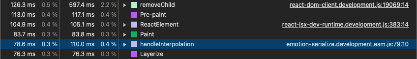
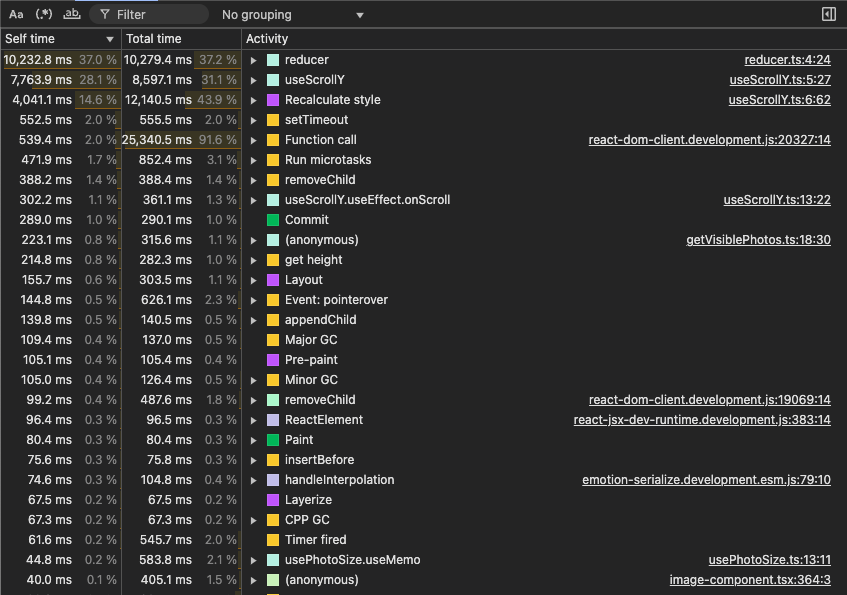
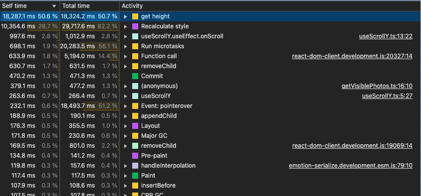
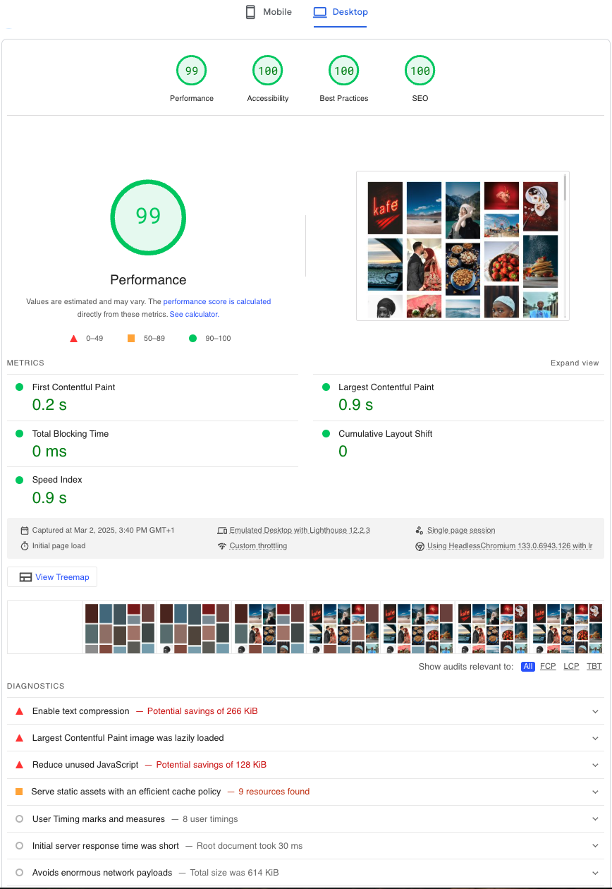
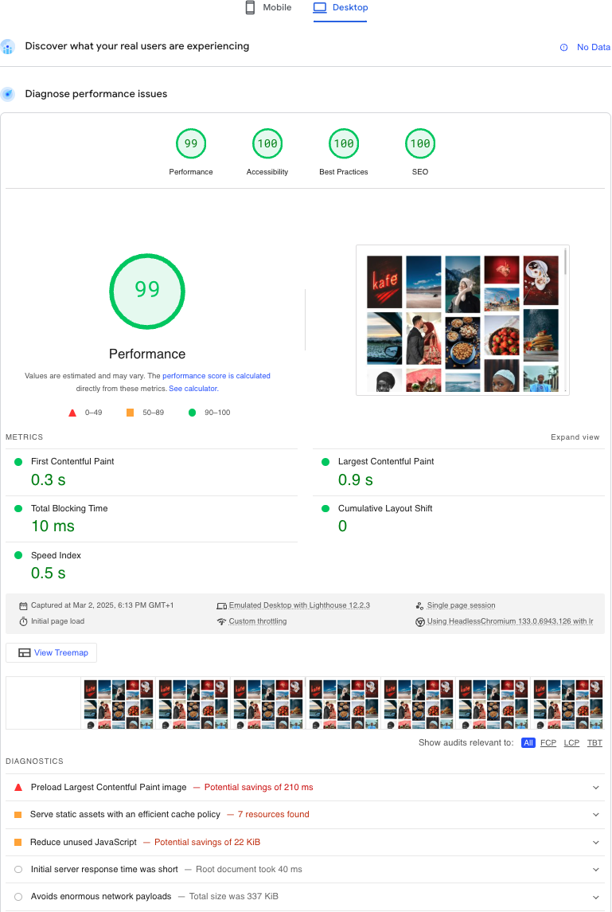
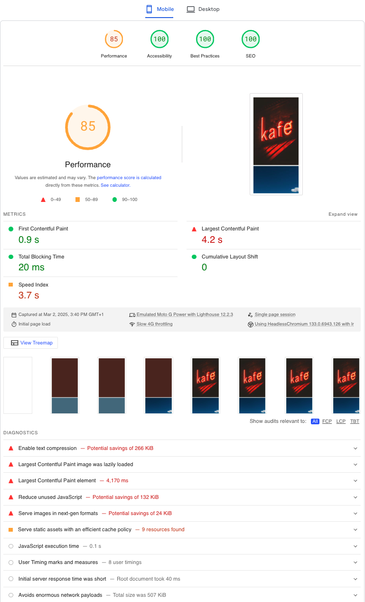
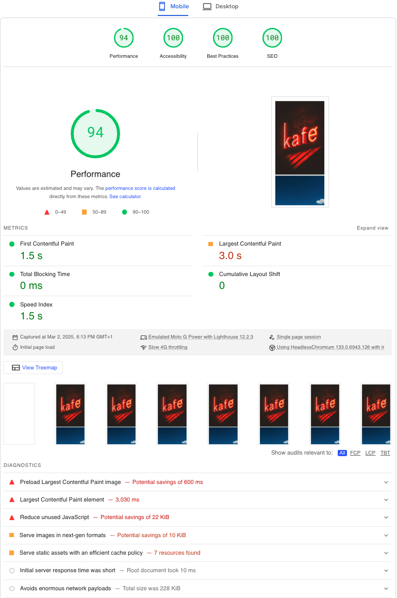
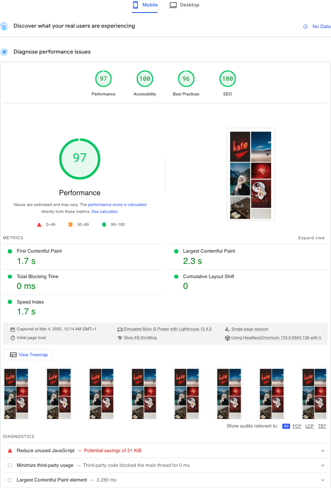
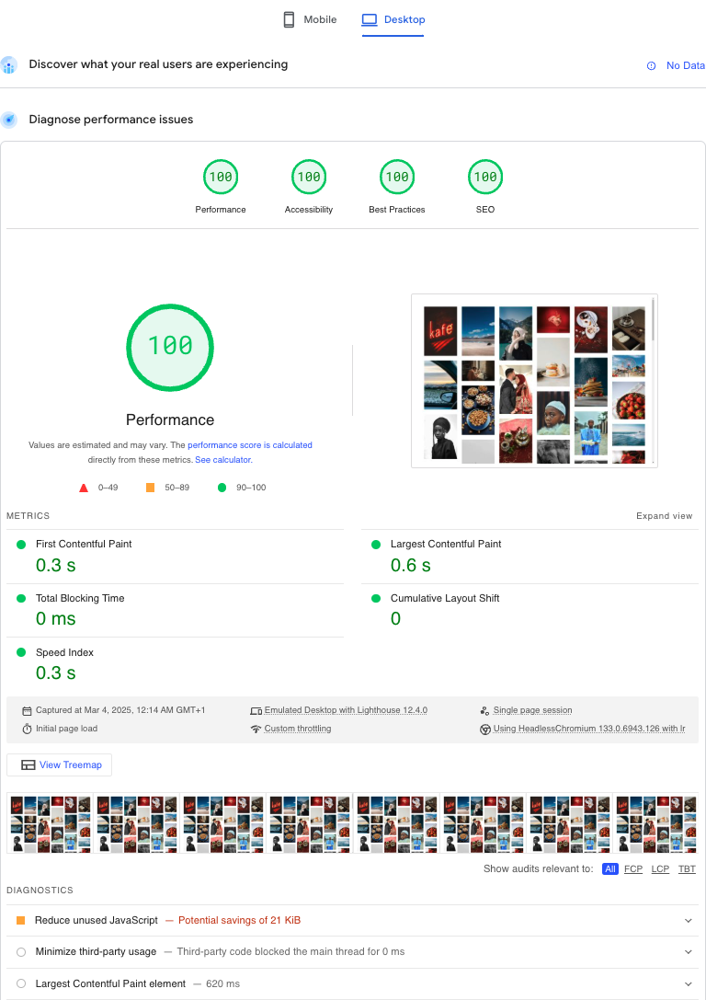

# masonry-grid

Responsive masonry grid, with performance optimizations.

View the masonry grid online at [photos.allenpasch.com](https://photos.allenpasch.com/)

## How To

### `yarn install`

Install the project.

### `yarn dev`

Run the project, and view it at [http://localhost:5173](http://localhost:5173)

### `yarn build`

Build the project.

## Architecture

## Performance

### styled-components → Emotion CSS

After [adding infinite scroll](https://github.com/AllenPasch/masonry-grid/pull/8), I noticed:

- Scrolling got slower and slower as I scrolled down.
- The DOM had an enormous `<style>` tag.
  - styled-components was not removing classes for removed components.
- I ran the Performance profiler in Chrome Dev Tools, and it showed styled-components used most of the CPU:

|                            styled-components                             |                         Emotion CSS                          |
| :----------------------------------------------------------------------: | :----------------------------------------------------------: |
|                             ❌ 93.4% of CPU                              |                        ✅ 0.3% of CPU                        |
|  |  |

Migrating styled-components to Emotion CSS made infinite scroll pretty smooth.

### useReducer → vanilla JS for cached photo sizes

|                            useReducer                            |                             vanilla JS                              |
| :--------------------------------------------------------------: | :-----------------------------------------------------------------: |
|                         ❌ 37.0% of CPU                          |                           ✅ 0.0% of CPU                            |
|  |  |

### Next.js → React Router

When setting up React Router, I noticed React Router supports static pre-rendering now.

After migrating from Next.js to React Router, PageSpeed Insights showed the same performance score for desktop and a better performance score for mobile:

#### Desktop

|                                    Next.js                                    |                                       React Router                                       |
| :---------------------------------------------------------------------------: | :--------------------------------------------------------------------------------------: |
|                           ✅ 99% Performance Score                            |                                 ✅ 99% Performance Score                                 |
|  |  |

#### Mobile

|                                   Next.js                                   |                                      React Router                                      |
| :-------------------------------------------------------------------------: | :------------------------------------------------------------------------------------: |
|                          ❌ 85% Performance Score                           |                                ✅ 94% Performance Score                                |
|  |  |

### Client Data Loading → Static Data Loading

I fixed the biggest performance problems mentioned by PageSpeed Insights by setting up:

- [Static Data Loading](https://reactrouter.com/start/framework/data-loading#static-data-loading) in the React Router framework.
- React Query to:
  - Call the Pexels API during build time.
  - [Dehydrate and hydrate](https://tanstack.com/query/latest/docs/framework/react/reference/hydration) its cache.
- Sticky image URLs for the images included in the static HTML.

|                      Mobile                       |                       Desktop                       |
| :-----------------------------------------------: | :-------------------------------------------------: |
|          ✅ 94% → 97% Performance Score           |           ✅ 99% → 100% Performance Score           |
|  |  |
