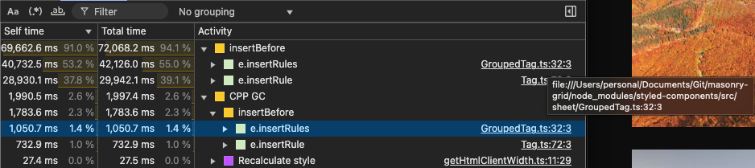

# masonry-grid

Responsive masonry grid, with performance optimizations.

## How To

### `yarn dev`

Run the project, and view it at [http://localhost:3000](http://localhost:3000)

### `yarn build`

Build the project.

## Performance

### styled-components → Emotion CSS

After [adding infinite scroll](https://github.com/AllenPasch/masonry-grid/pull/8), I noticed:

- Scrolling got slower and slower as I scrolled down.
- The DOM had an enormous `<style>` tag.
  - styled-components was not removing classes for removed components.
- I ran the Performance profiler in Chrome Dev Tools, and it showed styled-components used most of the CPU:

|                       styled-components                        |                    Emotion CSS                     |
| :------------------------------------------------------------: | :------------------------------------------------: |
|  |  |
|                          93.4% of CPU                          |                    0.3% of CPU                     |

Migrating styled-components to Emotion CSS made infinite scroll pretty smooth.
